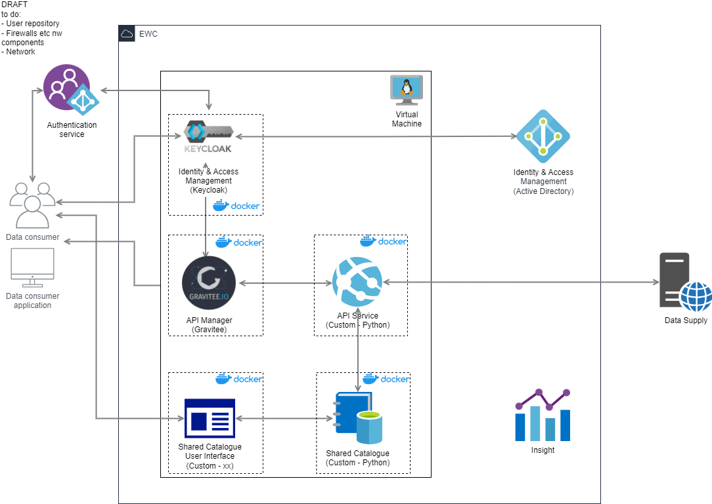
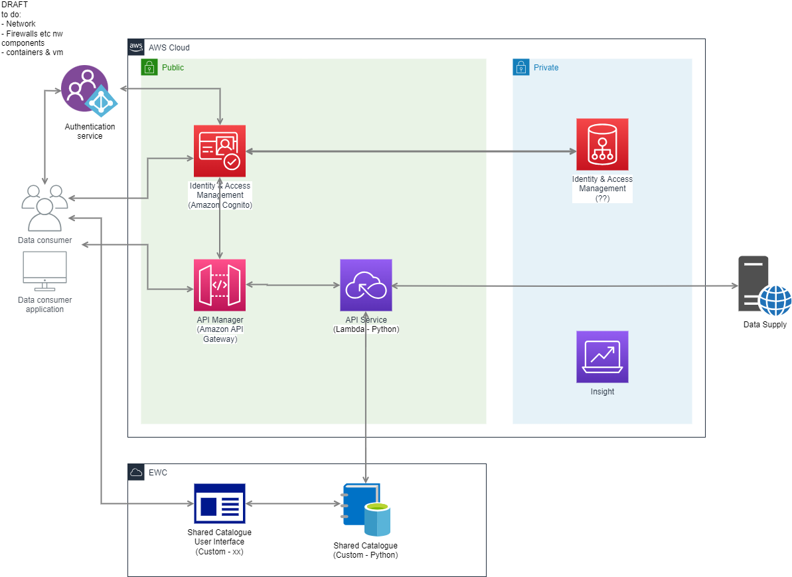

== Components

The rodeo-wp2-poc project consist of *five* diffrenent components:

API Serivce/Manager:: Python programn which handels the rewriting o metadata links and the proxying of actual data. Also inludes serverless.yml file for quick AWS deployment.  Found in directory `+./api-manager-demo+`

Shared catalogue/Metadata catalogue:: Stores and validates wcmp2 discovery metadata records. This code is forked from WMO-project https://github.com/wmo-im/wis2-gdc[Wis2-gdc] . Found in git submodule `+./rodeo-poc-wis2-gdc+`

Shared catalogue UI:: Next.js based web UI.  Presents the dicovery metadata as browsable elements and links to actual data collections. Found in directory `+./catalog-ui+`

Gravitee:: Gravitee is used as an API Manager in front of Shared catalogue and API Service. Default config is found in `./+gravitee-config+` directory and `+./gravitee-api-definitions+` contains default API-definitions to import to Gravitee.

Keycloack:: Keycloack is used as an identity and access provider for Gravitee. Neede Keycloack Gravitee plugins are stored in directory `./+gravitee+`

=== EWC
EWC deployment scenario is handled by docker compose and Nginx is used as a reverse proxy for Gravitee and for setting up possible TLS/SSL connection. Every service is registered as as Gravitee API expect for Keycloack.

=== AWS
AWS is used to to host the python API Service while the AWS API Gateway is used instead of Gravitee. Identity and access is handled by AWS Cognito instead of Keycloack.

The API Service and API Gateaway are deployed using https://www.serverless.com/plugins/serverless-wsgi[Serverles wsgi] based on `+./api-manager-demo/serverless.yml+` which creates a Cloudformation stack to host the API Service as Lambda function and an API Gateway to proxy connnections to the Lambda.

